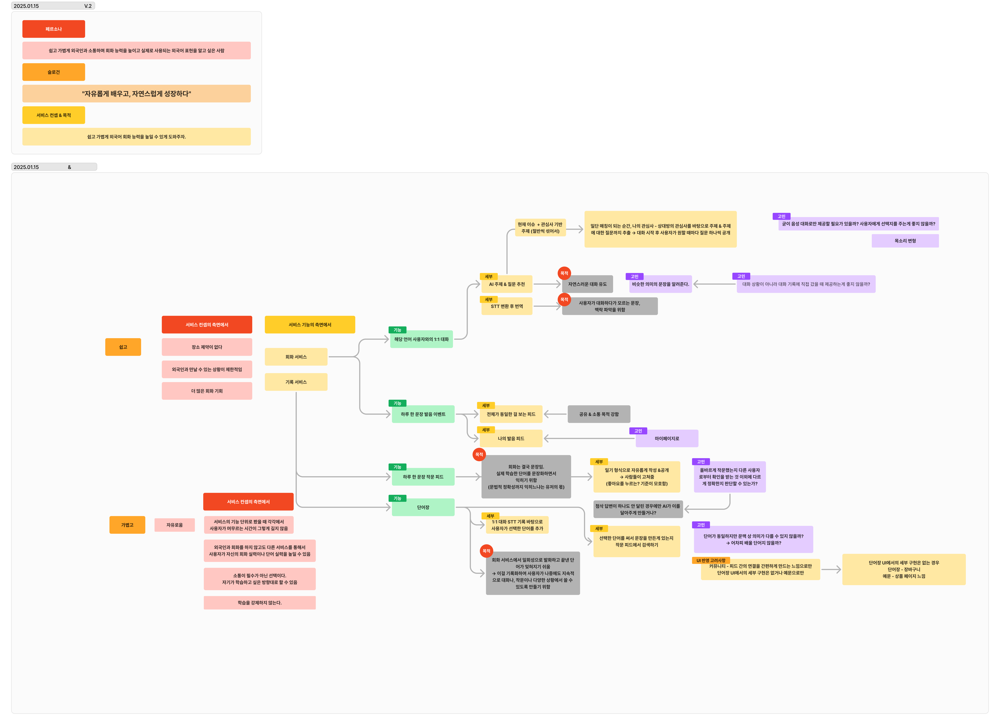
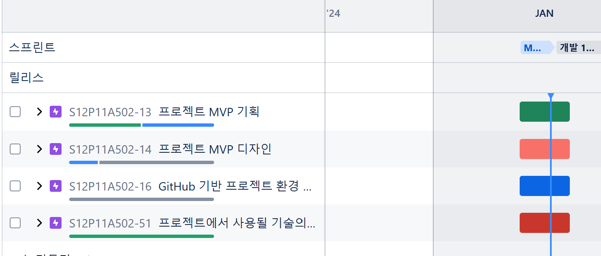
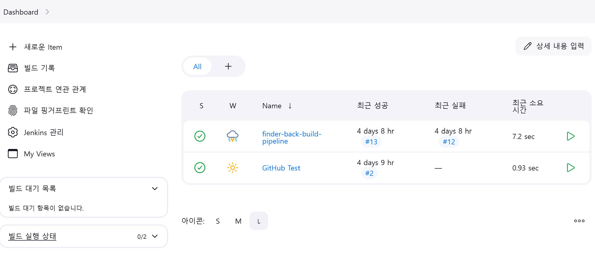

### 프로젝트 진행을 위한 기초 세팅
- Notion 기반 프로젝트 양식 작성
- Figma & Figjam 페이지 작성

[Figjam Link](https://www.figma.com/board/O5tpYluec4Y30jis48FGRu/Ideation?node-id=0-1&t=UFEqXINCEXojcPFZ-1)

### 스프린트1 Jira 세팅

### DooD 방식 기반 Jenkins - Docker 테스트

